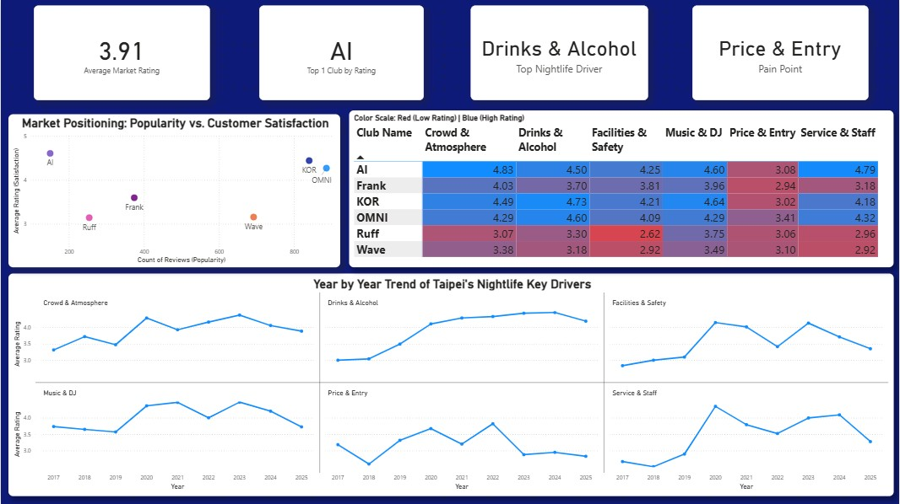
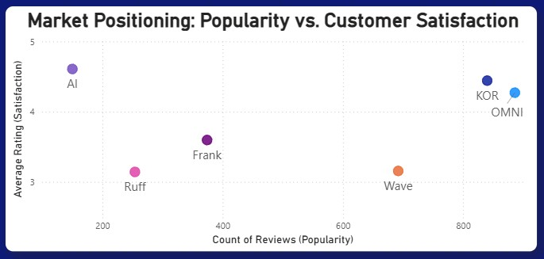
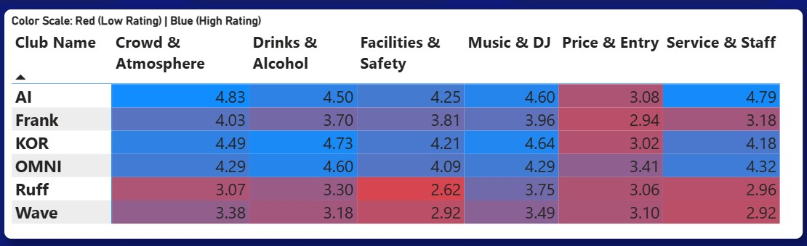
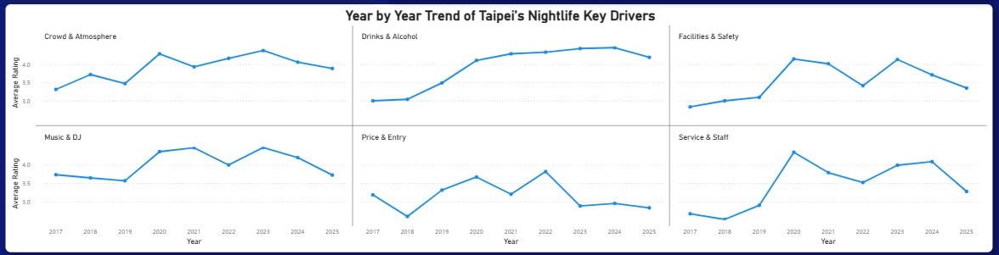

# Taipei Nightlife Sentiment Analysis 🍸

**A data engineering and analysis pipeline extracting 6,000+ Google Reviews to uncover market trends in the Taipei nightlife industry.**


### 📊 Project Overview
This project analyzes **6,626 customer reviews** across Taipei's top nightclubs (OMNI, KOR, AI, Wave, Ruff, Frank) to determine the key drivers of customer satisfaction. Using Python for data scraping and Power BI for semantic modeling, I built an interactive executive dashboard to visualize the trade-off between **Market Popularity (Volume)** and **Customer Experience (Sentiment)**.

---

## 🚀 Executive Dashboard

*(Note: Replace 'dashboard_final.png' with your actual image filename)*

---

## 💡 Key Insights by Visualization

### 1. Market Positioning Matrix (Scatter Plot)


**Chart:** *Popularity (X-Axis) vs. Customer Satisfaction (Y-Axis)*
* **The Market Leaders (OMNI, KOR):** These venues have achieved the "holy grail" of nightlife operations—sustaining high review volume (>800 reviews) while maintaining top-tier sentiment ratings (>4.3 stars).
* **The "Hidden Gem" (AI):** AI currently holds the highest overall market rating (**4.6+**), outperforming all competitors in quality, though with lower overall visibility/volume than the legacy giants.
* **The Volume Trap (Wave):** Despite having high foot traffic (high review count), Wave suffers from the lowest sentiment in the cohort. This suggests a business model reliant on "churn-and-burn" tourist traffic rather than repeat customer loyalty.

### 2. Operational Performance Heatmap

**Chart:** *Club Name vs. Review Category (Service, Drinks, Price, Music)*
* **The Primary Satisfaction Driver:** **"Drinks & Alcohol"** is the strongest performing category industry-wide. Top-tier venues like **KOR (4.73)** and **OMNI (4.60)** differentiate themselves here, proving that product quality is the most reliable predictor of a 5-star review.
* **Universal Pain Point:** **"Price & Entry"** is the single lowest-rated category. Even top-tier clubs struggle to break a 3.5 rating here, indicating high market-wide price sensitivity.
* **The "Love/Hate" Factor:** **"Service & Staff"** is highly polarizing. While it propels **AI** to the #1 spot (4.79 rating), it is the primary reason for **Ruff's** low ranking (2.96), making staff training a critical swing factor.

### 3. Longitudinal Trends (Small Multiples)

**Chart:** *Year-over-Year Average Rating (2017–2025)*
* **The "Revenge Spending" Bubble:** In 2022, satisfaction with "Price & Entry" peaked at ~3.8 stars. This anomaly likely reflects the post-COVID reopening euphoria where customers were less price-sensitive.
* **The 2024 Correction:** Since 2023, the "Price" sentiment has crashed back down to ~3.0, signaling that the "honeymoon phase" is over and the market has returned to high price sensitivity.
* **Resilience:** "Drinks & Alcohol" ratings have remained on a steady uptrend for 5 years, reinforcing its status as the "Top Nightlife Driver."

---
## 🛠️ Tech Stack
### 1. Technologies Used
* **Data Collection:** Python (`playwright`) for dynamic web scraping of infinite-scroll Google Review pages.
* **Data Processing:** Utilized `pandas` for advanced preprocessing, including regex-based cleaning, timestamp normalization, and flattening (exploding) multi-label review datasets.
* **Visualization:** Microsoft Power BI (Dashboarding & Reporting).

### 2. Data Modeling (Power BI)
* **Star Schema:** Designed a data model connecting `Reviews` (Fact Table) to a `Calendar` (Date Table) to enable time-intelligence functions.
* **DAX Measures:**
    * `Sentiment Score` = `AVERAGE(Rating)` (Used over SUM to normalize for volume).
    * `Top Driver` = `TOPN(1, Categories, [Avg Rating])` to dynamically identify the strongest feature of any selected club.

## 📂 Dataset & Structure
The Python pipeline exports cleaned CSV files ready for Power BI ingestion:
* `OMNI_reviews_clean_exploded.csv`
* `KOR_reviews_clean_exploded_final.csv`
* `Frank_reviews_clean_exploded_final.csv`
* `AI_reviews_clean_exploded.csv`
* `Ruff - Exploded Dataset Final.csv`
* `wave_reviews_clean_exploded.csv`
   ```bash
   git clone [https://github.com/robimengote/Data-Analysis-of-Taipei-Nightlife.git](https://github.com/robimengote/Data-Analysis-of-Taipei-Nightlife.git)


## 📬 Contact
If you found this analysis interesting, feel free to connect!
* **LinkedIn:** [https://www.linkedin.com/in/robirodd]
